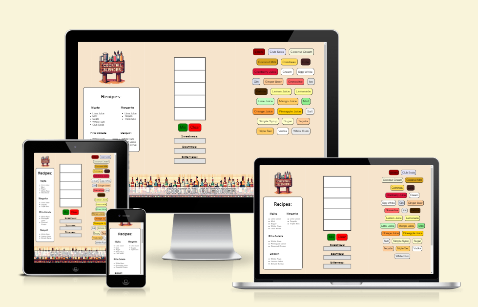
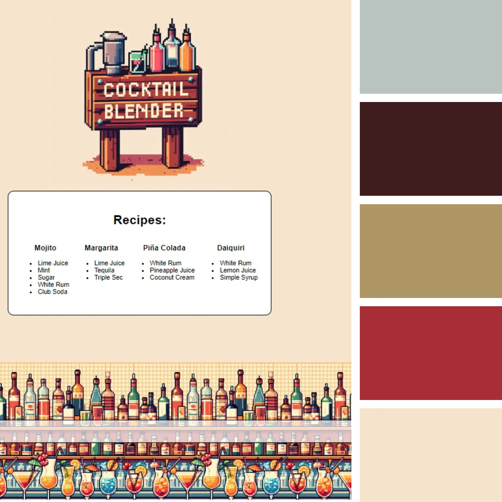

# Blender App

This web App project was created to show people the cocktail culture and show the visual result of mixing various ingredients.

[View Blender App on Github Pages](https://terraeb.github.io/Project_2/)

 

## CONTENTS

* [User Experience (UX)](#User-Experience-(UX))
  * [Initial Discussion](#Initial-Discussion)
  * [User Stories](#User-Stories)

* [Design](#Design)
  * [Colour Scheme](#Colour-Scheme)
  * [Typography](#Typography)
  * [Imagery](#Imagery)
  * [Wireframe](#Wireframe)
  * [Features](#Features)
  * [Accessibility](#Accessibility)

* [Technologies Used](#Technologies-Used)
  * [Languages Used](#Languages-Used)
  * [Frameworks, Libraries & Programs Used](#Frameworks,-Libraries-&-Programs-Used)

* [Deployment & Local Development](#Deployment-&-Local-Development)
  * [Deployment](#Deployment)
  * [Local Development](#Local-Development)
    * [How to Fork](#How-to-Fork)
    * [How to Clone](#How-to-Clone)

* [Testing](#Testing)
  * [W3C Validator](#W3C-Validator)
  * [Known Bugs](#Known-Bugs)
  * [Future Features](#Future-Features)
    * [Testing User Stories](#Testing-User-Stories) 
    * [Index Page](#Index-Page) 
    * [Contact Us Page](#Contact-Us-Page) 
  * [Full Testing](#Full-Testing)
  
* [Credits](#Credits) 
  * [Content](#Content)
  * [Media](#Media) 

- - -

## User Experience (UX)

### Initial Discussion

A web application that allows you to see the result of mixing various ingredients for a cocktail.

#### Key information for the site

* Cocktail recipes
* Various ingredients for cocktails.
* Obtaining color by mixing different ingredients.
* Ability to predict the taste and color of the mixture.

### User Stories

#### Client Goals

* To be able to view the application on devices of different sizes.
* To easily learn more about cocktail mixes
* So that you can easily repeat the cocktail thanks to the recipe.

- - -

## Design

### Colour Scheme

The colour palette was created using the [Coolors](https://coolors.co/) website.

### Typography

Sans serif

### Imagery

The images were created using artificial intelligence namely: Main picturce "Bing Image AI ([www.bing.com/images/create](https://www.bing.com/images/create))".

### Wireframe

Wireframe App

 
[![Wireframe][1]][1]
 
[1]: ./docs/wireframe.png
 

### Features

The web application consists of one page, but it is divided into 3 main sections (recipes/tips, blender (flavor properties) and ingredients).

* On the left is the “recipes/tips” section.
  * Logo
  * All recipes are taken from a separate JS file. 
  * Cocktail recipes, if you collect them the user will receive a “Congratulations” pop-up.

* In the center is the "Blender" section
  * Brander with "MIX" and "Clear" buttons. When you press the "MIX" button, the user will receive the result of mixing the colors of the ingredients. When you press the "Clear" button, the Blender will be cleared of the added ingredients.
  * Also, the added ingredient in Blender has a button under the name of the ingredient “Delete”, it makes it possible to delete one specific ingredient.
  * Under Blender there is a “Taste” section, it shows the three main taste properties obtained by adding ingredients to the Blender. Sweetness, Sourness and Bitterness

* On the right is the "Ingredients" section
  * All ingredients are taken from a separate JS file. 
  * Each ingredient has its own properties: Name, color, taste (sweetness, sourness, bitterness)
  * All buttons with an ingredient are filled with the color of the ingredient itself.
  * When you click on an ingredient, it will be added to the central section of the Blender. And part of the Blender will be colored in the color of the ingredient.

### Accessibility

While writing code, I paid attention to making the web application as accessible and user-friendly as possible. I achieved this thanks to:

* Using semantic HTML/CSS/JS.
* Use descriptive alt attributes for images on the site. 
* Ensuring sufficient color contrast throughout the site.

- - -

## Technologies Used

### Languages Used

HTML,CSS and JS were used to create this website.

### Frameworks, Libraries & Programs Used

ChatGPT - used, after receiving the result was rebuilt and adapted code.

Git - For version control.

Visual Studio Code - desktop version IDE.

Github - To save and store the files for the website.

Google Dev Tools - To troubleshoot and test features, solve issues with responsiveness and styling.

[Tiny PNG](https://tinypng.com/) To compress images.

[Favicon.io](https://favicon.io/) To create favicon.

[Am I Responsive?](http://ami.responsivedesign.is/) To show the website image on a range of devices.

- - -

## Deployment & Local Development

### Deployment

Github Pages was used to deploy the live website. The instructions to achieve this are below:

1. Log in (or sign up) to Github.
2. Find the repository for this project, Project_2.
3. Click on the Settings link.
4. Click on the Pages link in the left hand side navigation bar.
5. In the Source section, choose main from the drop down select branch menu. Select Root from the drop down select folder menu.
6. Click Save. Your live Github Pages site is now deployed at the URL shown.

### Local Development

#### How to Fork

To fork the Project_2 repository:

1. Log in (or sign up) to Github.
2. Go to the repository for this project, TeRRaeB/Project_2.
3. Click the Fork button in the top right corner.

#### How to Clone

To clone the Project_2 repository:

1. Log in (or sign up) to GitHub.
2. Go to the repository for this project, TeRRaeB/Project_2.
3. Click on the code button, select whether you would like to clone with HTTPS, SSH or GitHub CLI and copy the link shown.
4. Open the terminal in your code editor and change the current working directory to the location you want to use for the cloned directory.
5. Type 'git clone' into the terminal and then paste the link you copied in step 3. Press enter.

- - -

## Testing

Testing was ongoing throughout the entire build. I utilised Chrome developer tools while building to pinpoint and troubleshoot any issues as I went along.
 
  * Site tested on the service (https://wave.webaim.org/)

Testing report

[![Testing report][2]][2]
 
[2]: ./docs/wave.webaim.png 

 

### W3C Validator

The W3C validator was used to validate the HTML on all pages of the website. It was also used to validate CSS in the style.css file.

  

HTML

 
[![HTML][3]][3]
 
[3]: ./docs/w3c_html.png

 

CSS

 
[![CSS][4]][4]
 
[4]: ./docs/w3c_css.png

 

JS

 
[![JS][5]][5]
 
[5]: ./docs/validation_js.png

"Two undefined variables" - this is due to the fact that 2 more files with recipes and ingredients are connected to the main JS file.

  

### Known bugs

* Contrast in the names of ingredients.
  * In the future, you can add a function that will determine by RGB (dark or light color of the ingredient) and thereby add a note to the font style whether it is necessary to change from the standard color (black) to white.

### Future features
* I would like to add an “Add ingredient” button, this will allow the user to add various ingredients themselves, and choose their color and taste there.
* You can also add a “Add recipe” button in the left section, and the user will add his favorite cocktails.

### Full Testing

To fully test my website I performed the following testing using a number of browsers (google chrome).

I also went through each page using google chrome developer tools to ensure that they responsive on all different screen sizes.

### Content

* Website content was taken primarily from Wikipedia.com

### Media 

* All images were created using AI 
 